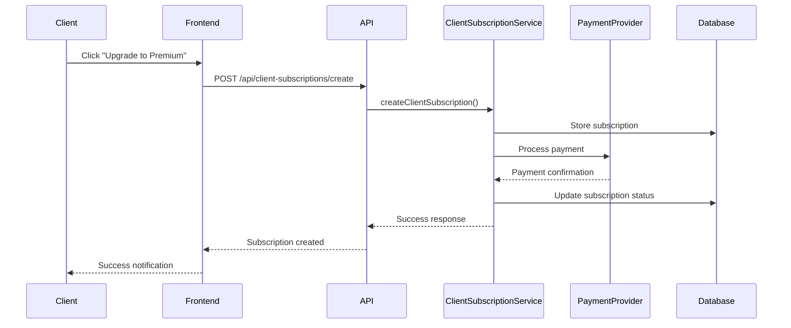

# Lingkod PH - Client Subscription System Documentation

## Table of Contents
1. [Overview](#overview)
2. [Architecture](#architecture)
3. [Client Subscription Plans](#client-subscription-plans)
4. [Database Schema](#database-schema)
5. [API Endpoints](#api-endpoints)
6. [Frontend Components](#frontend-components)
7. [Feature Access Control](#feature-access-control)
8. [Payment Integration](#payment-integration)
9. [Admin Interface](#admin-interface)
10. [Usage Examples](#usage-examples)
11. [Deployment Guide](#deployment-guide)
12. [Troubleshooting](#troubleshooting)

---

## Overview

The Lingkod PH client subscription system provides a comprehensive tiered access model for clients, offering both free and premium subscription plans. The system includes feature access control, payment processing, analytics, and administrative tools specifically designed for service discovery and booking enhancement.

### Key Features
- **Two-tier subscription model**: Free and Premium plans
- **Feature-based access control**: Granular permissions based on subscription tier
- **Payment integration**: PayPal, GCash, Maya, and Bank Transfer support
- **Usage tracking**: Monitor feature usage and limits
- **Analytics dashboard**: Booking insights for Premium clients
- **Admin management**: Complete client subscription oversight
- **Enhanced search**: Advanced filtering and verified provider access
- **Priority booking**: Early access to top-rated providers

---

## Architecture

### System Components

```
┌─────────────────────────────────────────────────────────────┐
│                    Frontend Layer                           │
├─────────────────────────────────────────────────────────────┤
│  Client Subscription UI  │  Feature Guards  │  Payment Components  │
│  Analytics Dashboard    │  Premium Badges  │  Admin Interface     │
└─────────────────────────────────────────────────────────────┘
                                │
┌─────────────────────────────────────────────────────────────┐
│                    API Layer                                │
├─────────────────────────────────────────────────────────────┤
│  /api/client-subscriptions/*  │  Feature Access Control     │
│  Payment Processing           │  Usage Tracking             │
└─────────────────────────────────────────────────────────────┘
                                │
┌─────────────────────────────────────────────────────────────┐
│                    Service Layer                            │
├─────────────────────────────────────────────────────────────┤
│  ClientSubscriptionService  │  ClientSearchService          │
│  Feature Access Validation  │  Analytics Processing         │
└─────────────────────────────────────────────────────────────┘
                                │
┌─────────────────────────────────────────────────────────────┐
│                    Database Layer                           │
├─────────────────────────────────────────────────────────────┤
│  Firestore Collections:                                     │
│  • clientSubscriptionPlans    • clientSubscriptions         │
│  • clientSubscriptionUsage   • clientSubscriptionPayments  │
│  • clientExclusiveDeals      • clientAnalytics             │
│  • customServiceRequests     • priorityBookings            │
└─────────────────────────────────────────────────────────────┘
```

---

## Client Subscription Plans

### Free Plan (₱0/month)
**Default plan for all clients**

#### Features:
- ✅ Standard provider search and filtering
- ✅ Book services with standard providers
- ✅ Basic email support for booking issues
- ✅ Community forum participation

#### Limits:
- 3 job posts maximum
- 10 bookings per month
- 20 favorites maximum
- No priority support
- No advanced search
- No booking analytics
- No priority booking
- No exclusive deals
- No custom requests
- No verified provider access

### Premium Client Plan (₱199/month)
**Premium plan with advanced features**

#### Features:
- ✅ **Advanced Search** - Advanced filters and verified provider access
- ✅ **Priority Booking** - Get priority access to top-rated providers
- ✅ **Booking Analytics** - Track booking history and spending patterns
- ✅ **Priority Support** - 24/7 priority customer support
- ✅ **Exclusive Deals** - Access to exclusive partner discounts
- ✅ **Custom Service Requests** - Post custom requests for specialized needs
- ✅ All Free plan features

#### Limits:
- 10 job posts maximum
- 50 bookings per month
- 100 favorites maximum
- Priority support access
- Advanced search features
- Booking analytics access
- Priority booking access
- Exclusive deals access
- Custom requests access
- Verified provider access

---

## Database Schema

### Collections Overview

#### 1. `clientSubscriptionPlans`
Stores available client subscription plans and their features.

```typescript
interface ClientSubscriptionPlan {
  id: string;
  name: string;
  tier: 'free' | 'premium';
  price: number;
  currency: 'PHP';
  features: ClientSubscriptionFeature[];
  limits: ClientSubscriptionLimits;
  isActive: boolean;
  createdAt: Timestamp;
  updatedAt: Timestamp;
}
```

#### 2. `clientSubscriptions`
Active client subscriptions.

```typescript
interface ClientSubscription {
  id: string;
  clientId: string;
  planId: string;
  tier: 'free' | 'premium';
  status: 'active' | 'cancelled' | 'expired' | 'pending';
  startDate: Timestamp;
  endDate: Timestamp;
  nextBillingDate: Timestamp;
  autoRenew: boolean;
  paymentMethod: 'paypal' | 'gcash' | 'maya' | 'bank_transfer';
  paymentReference?: string;
  amount: number;
  currency: 'PHP';
  features: ClientSubscriptionFeature[];
  limits: ClientSubscriptionLimits;
  createdAt: Timestamp;
  updatedAt: Timestamp;
}
```

#### 3. `clientSubscriptionUsage`
Monthly usage tracking for each client.

```typescript
interface ClientSubscriptionUsage {
  id: string;
  clientId: string;
  subscriptionId: string;
  period: string; // YYYY-MM format
  usage: {
    jobPosts: number;
    bookings: number;
    favorites: number;
    advancedSearches: number;
    priorityBookings: number;
    customRequests: number;
    analyticsViews: number;
  };
  limits: ClientSubscriptionLimits;
  createdAt: Timestamp;
  updatedAt: Timestamp;
}
```

#### 4. `clientSubscriptionPayments`
Payment history and records for client subscriptions.

```typescript
interface ClientSubscriptionPayment {
  id: string;
  subscriptionId: string;
  clientId: string;
  amount: number;
  currency: 'PHP';
  paymentMethod: 'paypal' | 'gcash' | 'maya' | 'bank_transfer';
  paymentReference: string;
  status: 'pending' | 'completed' | 'failed' | 'refunded';
  paymentDate: Timestamp;
  dueDate: Timestamp;
  description: string;
  metadata?: Record<string, any>;
  createdAt: Timestamp;
  updatedAt: Timestamp;
}
```

#### 5. `clientExclusiveDeals`
Partner discount offers for Premium clients.

```typescript
interface ClientExclusiveDeal {
  id: string;
  partnerId: string;
  partnerName: string;
  category: string;
  discountPercentage: number;
  discountAmount: number;
  minSpend: number;
  maxDiscount: number;
  validFrom: Timestamp;
  validTo: Timestamp;
  isActive: boolean;
  description: string;
  terms: string[];
  applicableServices: string[];
  createdAt: Timestamp;
}
```

#### 6. `customServiceRequests`
Custom service requests posted by Premium clients.

```typescript
interface CustomServiceRequest {
  id: string;
  clientId: string;
  title: string;
  description: string;
  category: string;
  budget: {
    min: number;
    max: number;
  };
  timeline: string;
  location: string;
  specialRequirements: string[];
  attachments: string[];
  status: 'draft' | 'published' | 'matched' | 'completed' | 'cancelled';
  matchedProviders: string[];
  createdAt: Timestamp;
  updatedAt: Timestamp;
}
```

#### 7. `priorityBookings`
Priority booking requests from Premium clients.

```typescript
interface PriorityBooking {
  id: string;
  clientId: string;
  providerId: string;
  serviceId: string;
  priorityLevel: 'high' | 'urgent' | 'emergency';
  requestedDate: Date;
  requestedTime: string;
  specialRequirements: string;
  estimatedBudget: number;
  status: 'pending' | 'accepted' | 'declined' | 'completed';
  createdAt: Timestamp;
  updatedAt: Timestamp;
}
```

#### 8. `clientAnalytics`
Analytics data for Premium clients.

```typescript
interface ClientAnalytics {
  clientId: string;
  period: string;
  metrics: {
    totalBookings: number;
    totalSpent: number;
    averageBookingValue: number;
    favoriteProviders: number;
    completedJobs: number;
    cancelledJobs: number;
    averageRating: number;
    responseTime: number;
  };
  trends: {
    bookingGrowth: number;
    spendingGrowth: number;
    satisfactionTrend: number;
    providerDiversity: number;
  };
  insights: string[];
  recommendations: string[];
  createdAt: Timestamp;
}
```

---

## API Endpoints

### Client Subscription Management

#### `GET /api/client-subscriptions/plans`
Get all available client subscription plans.

**Response:**
```json
{
  "success": true,
  "plans": [
    {
      "id": "plan_id",
      "name": "Premium Client",
      "tier": "premium",
      "price": 199,
      "features": [...],
      "limits": {...}
    }
  ]
}
```

#### `GET /api/client-subscriptions/current`
Get current client subscription.

**Headers:**
```
Authorization: Bearer <firebase_token>
```

**Response:**
```json
{
  "success": true,
  "subscription": {
    "id": "sub_id",
    "tier": "premium",
    "status": "active",
    "amount": 199,
    "nextBillingDate": "2024-02-15T00:00:00Z"
  }
}
```

#### `POST /api/client-subscriptions/create`
Create new client subscription.

**Headers:**
```
Authorization: Bearer <firebase_token>
Content-Type: application/json
```

**Body:**
```json
{
  "planId": "plan_id",
  "paymentMethod": "paypal",
  "paymentReference": "payment_id",
  "amount": 199
}
```

#### `POST /api/client-subscriptions/check-access`
Check feature access for client.

**Headers:**
```
Authorization: Bearer <firebase_token>
Content-Type: application/json
```

**Body:**
```json
{
  "feature": "advanced_search"
}
```

**Response:**
```json
{
  "success": true,
  "hasAccess": true,
  "remainingUsage": -1,
  "limit": -1
}
```

---

## Frontend Components

### Core Components

#### 1. `ClientSubscriptionPaymentButton`
Handles client subscription payments with multiple payment methods.

```tsx
<ClientSubscriptionPaymentButton
  plan={premiumPlan}
  onPaymentSuccess={(subscriptionId) => {
    // Handle successful payment
  }}
  onPaymentError={(error) => {
    // Handle payment error
  }}
/>
```

#### 2. `ClientFeatureGuard`
Protects Premium-only features with upgrade prompts.

```tsx
<ClientFeatureGuard feature="advanced_search">
  <AdvancedSearchFilters />
</ClientFeatureGuard>
```

#### 3. `ClientSubscriptionBadge` / `VerifiedPremiumClientBadge`
Displays client subscription tier badges.

```tsx
<VerifiedPremiumClientBadge variant="large" />
<ClientSubscriptionBadge tier="premium" variant="compact" />
```

### Specialized Guards

#### `AdvancedSearchGuard`
```tsx
<AdvancedSearchGuard>
  <AdvancedSearchInterface />
</AdvancedSearchGuard>
```

#### `PriorityBookingGuard`
```tsx
<PriorityBookingGuard>
  <PriorityBookingForm />
</PriorityBookingGuard>
```

#### `BookingAnalyticsGuard`
```tsx
<BookingAnalyticsGuard>
  <ClientAnalyticsDashboard />
</BookingAnalyticsGuard>
```

#### `ExclusiveDealsGuard`
```tsx
<ExclusiveDealsGuard>
  <PartnerDiscountsList />
</ExclusiveDealsGuard>
```

#### `CustomRequestsGuard`
```tsx
<CustomRequestsGuard>
  <CustomServiceRequestForm />
</CustomRequestsGuard>
```

---

## Feature Access Control

### Usage Hooks

#### `useClientSubscription()`
Main hook for client subscription management.

```tsx
const {
  subscription,
  plans,
  loading,
  checkFeatureAccess,
  refreshSubscription,
  upgradeToPremium
} = useClientSubscription();
```

#### `useClientFeatureAccess(feature)`
Check access to specific features.

```tsx
const { hasAccess, loading, remainingUsage, limit } = useClientFeatureAccess('advanced_search');
```

#### `usePremiumClientSubscription()`
Check Premium subscription status.

```tsx
const { isPremium, isActive, subscription } = usePremiumClientSubscription();
```

### Feature Keys

```typescript
const CLIENT_SUBSCRIPTION_FEATURES = {
  ADVANCED_SEARCH: 'advanced_search',
  PRIORITY_BOOKING: 'priority_booking',
  BOOKING_ANALYTICS: 'booking_analytics',
  PRIORITY_SUPPORT: 'priority_support',
  EXCLUSIVE_DEALS: 'exclusive_deals',
  CUSTOM_REQUESTS: 'custom_requests',
  VERIFIED_PROVIDER_ACCESS: 'verified_provider_access',
  EXTENDED_JOB_POSTS: 'extended_job_posts',
  EXTENDED_BOOKINGS: 'extended_bookings',
  EXTENDED_FAVORITES: 'extended_favorites'
} as const;
```

---

## Payment Integration

### Supported Payment Methods

1. **PayPal** - Automated processing
2. **GCash** - Via Adyen integration
3. **Maya** - Manual verification
4. **Bank Transfer** - Manual verification

### Payment Flow



### Payment Components

#### PayPal Integration
```tsx
<PayPalCheckoutButton
  amount={199}
  currency="PHP"
  description="Premium Client Subscription - Monthly"
  onSuccess={(paymentData) => handlePaymentSuccess(paymentData)}
  onError={(error) => handlePaymentError(error)}
/>
```

#### GCash Integration
```tsx
<GCashPaymentButton
  amount={199}
  description="Premium Client Subscription"
  onSuccess={(paymentData) => handlePaymentSuccess(paymentData)}
  onError={(error) => handlePaymentError(error)}
/>
```

---

## Admin Interface

### Admin Dashboard Features

#### Client Subscription Statistics
- Total client subscriptions
- Active subscriptions
- Premium vs Free breakdown
- Monthly revenue tracking
- Conversion metrics

#### Client Management
- View all client subscriptions
- Subscription status overview
- Payment history
- Usage analytics
- Manual subscription management

#### Revenue Analytics
- Monthly revenue trends
- Payment method breakdown
- Churn analysis
- Growth metrics

### Admin Routes

```
/admin/client-subscriptions - Main client subscription management
/admin/client-subscriptions/[id] - Individual subscription details
/admin/client-subscriptions/analytics - Revenue and usage analytics
```

---

## Usage Examples

### 1. Checking Feature Access

```tsx
import { useClientFeatureAccess } from '@/hooks/use-client-subscription';

function MyComponent() {
  const { hasAccess, loading } = useClientFeatureAccess('advanced_search');
  
  if (loading) return <LoadingSpinner />;
  
  if (!hasAccess) {
    return <UpgradePrompt feature="advanced_search" />;
  }
  
  return <AdvancedSearchInterface />;
}
```

### 2. Recording Feature Usage

```tsx
import { clientSubscriptionService } from '@/lib/client-subscription-service';

async function performAdvancedSearch(clientId: string, searchParams: any) {
  // Perform search logic...
  
  // Record usage
  await clientSubscriptionService.recordClientFeatureUsage(
    clientId,
    'advanced_search'
  );
}
```

### 3. Enhanced Search for Premium Clients

```tsx
import { clientSearchService } from '@/lib/client-search-service';

async function searchProviders(clientId: string, filters: PremiumSearchFilters) {
  const results = await clientSearchService.searchProviders(
    clientId,
    searchTerm,
    filters,
    20
  );
  return results;
}
```

### 4. Creating Custom Service Requests

```tsx
import { clientSubscriptionService } from '@/lib/client-subscription-service';

async function createCustomRequest(clientId: string, requestData: any) {
  const result = await clientSubscriptionService.createCustomServiceRequest(
    clientId,
    requestData
  );
  return result;
}
```

### 5. Priority Booking

```tsx
import { clientSubscriptionService } from '@/lib/client-subscription-service';

async function createPriorityBooking(clientId: string, bookingData: any) {
  const result = await clientSubscriptionService.createPriorityBooking(
    clientId,
    bookingData
  );
  return result;
}
```

---

## Deployment Guide

### 1. Environment Setup

#### Required Environment Variables
```env
# Firebase Configuration
FIREBASE_PROJECT_ID=your-project-id
FIREBASE_CLIENT_EMAIL=your-client-email
FIREBASE_PRIVATE_KEY=your-private-key

# Payment Configuration
PAYPAL_CLIENT_ID=your-paypal-client-id
PAYPAL_CLIENT_SECRET=your-paypal-client-secret
ADYEN_API_KEY=your-adyen-api-key
ADYEN_MERCHANT_ACCOUNT=your-adyen-merchant-account
```

### 2. Database Initialization

#### Initialize Default Plans
```typescript
import { clientSubscriptionService } from '@/lib/client-subscription-service';

// Run this once to initialize default client subscription plans
await clientSubscriptionService.initializeDefaultPlans();
```

#### Firestore Security Rules
```javascript
// Add to firestore.rules
match /clientSubscriptionPlans/{planId} {
  allow read: if true; // Public read access
  allow write: if isAdmin();
}

match /clientSubscriptions/{subscriptionId} {
  allow read: if isOwner(resource.data.clientId) || isAdmin();
  allow write: if isAdmin();
}

match /clientSubscriptionUsage/{usageId} {
  allow read: if isOwner(resource.data.clientId) || isAdmin();
  allow write: if isOwner(resource.data.clientId) || isAdmin();
}
```

### 3. Middleware Configuration

#### Update Route Protection
```typescript
// middleware.ts
const protectedRoutes = {
  '/client-subscription': ['client'],
  '/client-analytics': ['client'],
  '/admin/client-subscriptions': ['admin'],
  // ... other routes
} as const;
```

### 4. Build and Deploy

```bash
# Install dependencies
npm install

# Build the application
npm run build

# Deploy to your hosting platform
npm run deploy
```

---

## Troubleshooting

### Common Issues

#### 1. Firebase Connection Errors
**Error:** "Firebase Firestore is not initialized"

**Solution:**
- Verify Firebase configuration in `.env.local`
- Check Firebase project settings
- Ensure Firestore is enabled in Firebase console

#### 2. Payment Processing Failures
**Error:** Payment methods not working

**Solution:**
- Verify PayPal/GCash API credentials
- Check payment provider status
- Review webhook configurations

#### 3. Feature Access Denied
**Error:** Premium features not accessible

**Solution:**
- Verify subscription status in database
- Check feature access permissions
- Ensure usage limits not exceeded

#### 4. Subscription Not Updating
**Error:** Subscription changes not reflected

**Solution:**
- Check real-time listeners
- Verify database write permissions
- Review subscription service logs

### Debug Mode

Enable debug logging:

```typescript
// Add to your environment
DEBUG_CLIENT_SUBSCRIPTION=true
```

### Monitoring

#### Key Metrics to Monitor
- Client subscription conversion rates
- Payment success rates
- Feature usage patterns
- Churn rates
- Revenue trends

#### Logging
```typescript
// Client subscription service includes comprehensive logging
console.log('Client subscription created:', subscriptionId);
console.log('Client feature access checked:', feature, hasAccess);
console.log('Client usage recorded:', clientId, feature, amount);
```

---

## Support and Maintenance

### Regular Tasks

1. **Monthly Revenue Reports** - Generate client subscription revenue analytics
2. **Usage Monitoring** - Track feature usage and limits
3. **Payment Reconciliation** - Verify payment processing accuracy
4. **Subscription Renewals** - Monitor auto-renewal success rates
5. **Feature Updates** - Add new Premium features and benefits

### Backup and Recovery

#### Database Backups
```bash
# Export client subscription data
gcloud firestore export gs://your-backup-bucket/client-subscriptions-$(date +%Y%m%d)
```

#### Payment Data Backup
- Regular exports of payment records
- Secure storage of payment references
- Compliance with PCI DSS requirements

---

## Conclusion

The Lingkod PH client subscription system provides a robust, scalable solution for managing client subscriptions with comprehensive feature access control, payment processing, and administrative tools. The system is designed to enhance the client experience while providing clear value to both free and Premium subscribers.

For additional support or feature requests, please refer to the development team or create an issue in the project repository.
