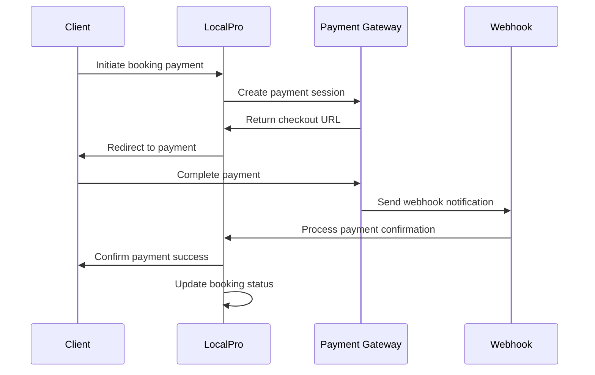
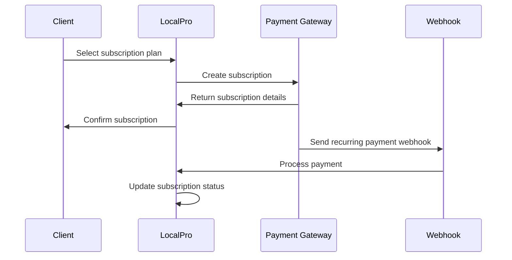
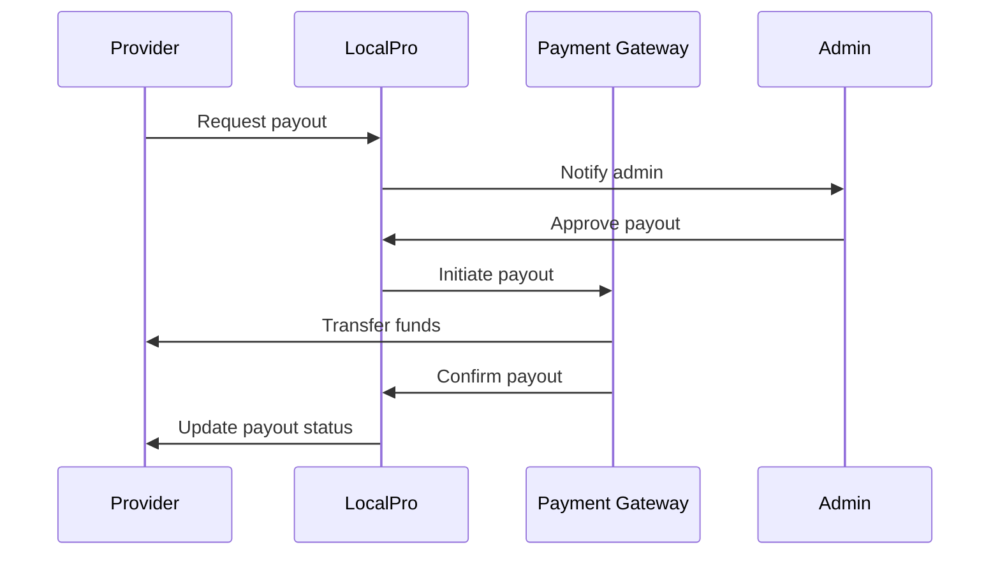

# Payment System Documentation - LocalPro

This document provides comprehensive documentation for the LocalPro payment system, including all payment methods, processing flows, and integration details.

## Table of Contents

1. [Payment System Overview](#payment-system-overview)
2. [Supported Payment Methods](#supported-payment-methods)
3. [Payment Processing Flows](#payment-processing-flows)
4. [Maya Integration](#maya-integration)
5. [PayPal Integration](#paypal-integration)
6. [Bank Transfer System](#bank-transfer-system)
7. [Payment Security](#payment-security)
8. [Error Handling](#error-handling)
9. [Testing & Development](#testing--development)

---

## Payment System Overview

The LocalPro payment system supports multiple payment methods to accommodate different user preferences and regional requirements. The system is designed for reliability, security, and ease of use.

### Key Features

- **Multiple Payment Methods**: Maya, PayPal, and Bank Transfer
- **Real-time Processing**: Instant payment confirmation
- **Secure Transactions**: End-to-end encryption and fraud protection
- **Commission Management**: Automated commission calculation and deduction
- **Payout System**: Automated provider payouts
- **Audit Trail**: Complete transaction logging
- **Webhook Support**: Real-time payment notifications

### Architecture

```
Client → Payment Gateway → LocalPro API → Database
                ↓
        Webhook Notifications
                ↓
        Payment Status Updates
```

---

## Supported Payment Methods

### 1. Maya Checkout

**Description:** Maya (formerly PayMaya) is a leading digital payment platform in the Philippines.

**Supported Features:**
- Credit/Debit Cards (Visa, Mastercard, JCB)
- E-wallets (GCash, GrabPay)
- QR Code payments
- Bank transfers
- Over-the-counter payments

**Advantages:**
- Local Philippine payment method
- High acceptance rate
- Real-time processing
- Comprehensive fraud protection

### 2. PayPal

**Description:** Global payment platform supporting international transactions.

**Supported Features:**
- PayPal account payments
- Credit/Debit card payments
- Bank transfers
- PayPal Credit
- International payments

**Advantages:**
- Global reach
- Buyer protection
- Recurring payments support
- Established trust

### 3. Bank Transfer

**Description:** Manual bank transfer with proof of payment upload.

**Supported Banks:**
- BPI (Bank of the Philippine Islands)
- BDO (Banco de Oro)
- Metrobank
- GCash
- Other major Philippine banks

**Process:**
1. Client receives bank details
2. Client makes transfer
3. Client uploads proof of payment
4. Admin verifies and confirms payment

---

## Payment Processing Flows

### Booking Payment Flow



### Subscription Payment Flow



### Payout Flow



---

## Maya Integration

### Configuration

**Environment Variables:**
```env
# Maya Configuration
NEXT_PUBLIC_MAYA_PUBLIC_KEY=your_public_key
MAYA_SECRET_KEY=your_secret_key
MAYA_ENVIRONMENT=sandbox # or production
MAYA_WEBHOOK_SECRET=your_webhook_secret
```

**API Endpoints:**
- `POST /api/payments/maya/checkout` - Create checkout session
- `GET /api/payments/maya/status` - Get payment status
- `POST /api/payments/maya/webhook` - Handle webhooks

### Checkout Session Creation

**Request:**
```json
{
  "bookingId": "booking_123",
  "amount": 1500.00,
  "type": "booking"
}
```

**Response:**
```json
{
  "success": true,
  "data": {
    "checkoutId": "checkout_456",
    "checkoutUrl": "https://checkout.maya.com/...",
    "expiresAt": "2024-01-01T12:00:00Z"
  }
}
```

### Webhook Processing

**Webhook Payload:**
```json
{
  "id": "checkout_456",
  "paymentStatus": "PAYMENT_SUCCESS",
  "requestReferenceNumber": "ref_789",
  "metadata": {
    "bookingId": "booking_123"
  },
  "fundSource": {
    "type": "CARD",
    "last4": "1234"
  }
}
```

**Security Features:**
- IP address verification
- Signature validation
- Environment-specific configurations
- Rate limiting

---

## PayPal Integration

### Configuration

**Environment Variables:**
```env
# PayPal Configuration
NEXT_PUBLIC_PAYPAL_CLIENT_ID=your_client_id
PAYPAL_CLIENT_SECRET=your_client_secret
PAYPAL_ENVIRONMENT=sandbox # or production
```

**API Endpoints:**
- `POST /api/payments/paypal/webhook` - Handle webhooks

### Webhook Processing

**Webhook Headers:**
```http
paypal-transmission-id: transmission_id
paypal-cert-id: cert_id
paypal-transmission-sig: signature
paypal-transmission-time: timestamp
```

**Webhook Payload:**
```json
{
  "id": "webhook_event_id",
  "event_type": "PAYMENT.SALE.COMPLETED",
  "resource": {
    "id": "payment_id",
    "state": "approved",
    "amount": {
      "total": "1500.00",
      "currency": "PHP"
    }
  }
}
```

---

## Bank Transfer System

### Bank Details

**Default Bank Information:**
```json
{
  "accountName": "LocalPro Services Inc.",
  "accountNumber": "1234-5678-90",
  "bankName": "BPI",
  "swiftCode": "BOPIPHMM"
}
```

### Payment Verification Process

1. **Client Uploads Proof:**
   - Screenshot of bank transfer
   - Bank receipt or confirmation
   - Transfer reference number

2. **Admin Verification:**
   - Review uploaded documents
   - Verify transfer details
   - Confirm payment amount
   - Update booking status

3. **Automated Notifications:**
   - Email confirmation to client
   - Notification to provider
   - Update booking status

### File Upload Requirements

**Supported Formats:**
- JPEG, PNG, WebP images
- PDF documents
- Maximum file size: 5MB

**Security Measures:**
- File type validation
- Virus scanning
- Secure storage
- Access controls

---

## Payment Security

### Data Protection

**Encryption:**
- TLS 1.3 for data in transit
- AES-256 for data at rest
- Encrypted payment tokens
- Secure key management

**PCI Compliance:**
- No storage of sensitive card data
- Tokenized payment information
- Secure payment processing
- Regular security audits

### Fraud Prevention

**Risk Assessment:**
- Transaction amount analysis
- User behavior monitoring
- Geographic location checks
- Device fingerprinting

**Security Measures:**
- Rate limiting
- IP address verification
- Signature validation
- Suspicious activity detection

### Audit Trail

**Logged Information:**
- All payment attempts
- Success and failure events
- User actions and changes
- System events and errors

**Retention Policy:**
- Payment logs: 7 years
- Audit logs: 3 years
- Error logs: 1 year
- Debug logs: 30 days

---

## Error Handling

### Payment Errors

**Common Error Types:**
- Insufficient funds
- Card declined
- Network timeout
- Invalid payment method
- Fraud detection

**Error Response Format:**
```json
{
  "success": false,
  "error": "Payment failed",
  "code": "PAYMENT_DECLINED",
  "details": {
    "reason": "Insufficient funds",
    "retryable": true
  }
}
```

### Retry Logic

**Automatic Retries:**
- Network errors: 3 attempts
- Timeout errors: 2 attempts
- Rate limit errors: 1 attempt
- Payment declined: No retry

**Retry Intervals:**
- Immediate retry for network errors
- 5-second delay for timeout errors
- 1-minute delay for rate limits

---

## Testing & Development

### Test Environment Setup

**Maya Sandbox:**
```env
MAYA_ENVIRONMENT=sandbox
NEXT_PUBLIC_MAYA_PUBLIC_KEY=sandbox_public_key
MAYA_SECRET_KEY=sandbox_secret_key
```

**PayPal Sandbox:**
```env
PAYPAL_ENVIRONMENT=sandbox
NEXT_PUBLIC_PAYPAL_CLIENT_ID=sandbox_client_id
PAYPAL_CLIENT_SECRET=sandbox_client_secret
```

### Test Cards

**Maya Test Cards:**
- Visa: 4111 1111 1111 1111
- Mastercard: 5555 5555 5555 4444
- Declined: 4000 0000 0000 0002

**PayPal Test Accounts:**
- Buyer: test-buyer@example.com
- Seller: test-seller@example.com

### Webhook Testing

**Local Development:**
```bash
# Install ngrok
npm install -g ngrok

# Start local server
npm run dev

# Expose webhook endpoint
ngrok http 3000

# Update webhook URL in payment gateway
```

**Webhook Testing Tools:**
- Maya webhook simulator
- PayPal webhook simulator
- Custom test endpoints

### Validation Scripts

**Payment System Validation:**
```bash
# Validate Maya configuration
npm run validate-maya

# Validate PayPal configuration
npm run validate-paypal

# Test payment flows
npm run test-payments
```

---

## Monitoring & Analytics

### Payment Metrics

**Key Performance Indicators:**
- Payment success rate
- Average processing time
- Failed payment reasons
- Revenue by payment method
- Chargeback rates

**Real-time Monitoring:**
- Payment processing status
- Error rates and types
- System performance
- Security alerts

### Reporting

**Daily Reports:**
- Transaction summary
- Payment method breakdown
- Error analysis
- Revenue tracking

**Monthly Reports:**
- Growth trends
- Payment method performance
- Fraud analysis
- System reliability

---

## Troubleshooting

### Common Issues

**Payment Declined:**
1. Check card details
2. Verify sufficient funds
3. Contact bank for restrictions
4. Try alternative payment method

**Webhook Failures:**
1. Check webhook URL accessibility
2. Verify signature validation
3. Review error logs
4. Test with webhook simulator

**Processing Delays:**
1. Check network connectivity
2. Verify payment gateway status
3. Review system logs
4. Contact support if persistent

### Support Contacts

**Technical Support:**
- Email: tech-support@localpro.asia
- Phone: +63 917 915 7515
- Response time: 24 hours

**Payment Issues:**
- Email: payments@localpro.asia
- Phone: +63 917 915 7515
- Response time: 4 hours

---

This payment system documentation provides comprehensive information about all payment methods and processes in the LocalPro platform. For implementation details, refer to the API documentation and developer guides.
