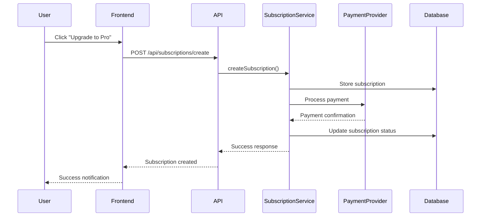

# Lingkod PH - Subscription System Documentation

## Table of Contents
1. [Overview](#overview)
2. [Architecture](#architecture)
3. [Subscription Plans](#subscription-plans)
4. [Database Schema](#database-schema)
5. [API Endpoints](#api-endpoints)
6. [Frontend Components](#frontend-components)
7. [Feature Access Control](#feature-access-control)
8. [Payment Integration](#payment-integration)
9. [Admin Interface](#admin-interface)
10. [Usage Examples](#usage-examples)
11. [Deployment Guide](#deployment-guide)
12. [Troubleshooting](#troubleshooting)

---

## Overview

The Lingkod PH subscription system provides a comprehensive tiered access model for providers, offering both free and premium (Pro) subscription plans. The system includes feature access control, payment processing, analytics, and administrative tools.

### Key Features
- **Two-tier subscription model**: Free and Pro plans
- **Feature-based access control**: Granular permissions based on subscription tier
- **Payment integration**: PayPal, GCash, Maya, and Bank Transfer support
- **Usage tracking**: Monitor feature usage and limits
- **Analytics dashboard**: Performance insights for Pro subscribers
- **Admin management**: Complete subscription oversight

---

## Architecture

### System Components

```
┌─────────────────────────────────────────────────────────────┐
│                    Frontend Layer                           │
├─────────────────────────────────────────────────────────────┤
│  Subscription UI  │  Feature Guards  │  Payment Components  │
│  Analytics        │  Pro Badges      │  Admin Interface     │
└─────────────────────────────────────────────────────────────┘
                                │
┌─────────────────────────────────────────────────────────────┐
│                    API Layer                                │
├─────────────────────────────────────────────────────────────┤
│  /api/subscriptions/*  │  Feature Access Control           │
│  Payment Processing    │  Usage Tracking                   │
└─────────────────────────────────────────────────────────────┘
                                │
┌─────────────────────────────────────────────────────────────┐
│                    Service Layer                            │
├─────────────────────────────────────────────────────────────┤
│  SubscriptionService  │  JobPriorityService                │
│  ProviderRanking      │  Feature Access Validation         │
└─────────────────────────────────────────────────────────────┘
                                │
┌─────────────────────────────────────────────────────────────┐
│                    Database Layer                           │
├─────────────────────────────────────────────────────────────┤
│  Firestore Collections:                                     │
│  • subscriptionPlans    • providerSubscriptions            │
│  • subscriptionUsage    • subscriptionPayments             │
│  • suppliesDiscounts    • subscriptionAnalytics            │
└─────────────────────────────────────────────────────────────┘
```

---

## Subscription Plans

### Free Plan (₱0/month)
**Default plan for all providers**

#### Features:
- ✅ Standard job access
- ✅ Profile visible in general listings
- ✅ Payment processing included
- ✅ Basic support

#### Limits:
- 10 job applications per month
- 5 services maximum
- 20 bookings per month
- No featured placement
- No priority job access
- No performance analytics
- No Pro badge
- No supplies discounts

### Pro Provider Plan (₱399/month)
**Premium plan with advanced features**

#### Features:
- ✅ **Featured Placement** - Show up at the top of search results
- ✅ **Job Priority Access** - Early access to high-value or urgent jobs
- ✅ **Performance Analytics** - Dashboard with detailed insights
- ✅ **Profile Badge** - "Verified Pro" badge builds trust
- ✅ **Discounted Supplies** - Access to exclusive partner deals
- ✅ All Free plan features

#### Limits:
- 50 job applications per month
- 20 services maximum
- 100 bookings per month
- Unlimited featured placement views
- Unlimited priority job access
- Unlimited analytics access
- Pro badge display
- Unlimited supplies discounts

---

## Database Schema

### Collections Overview

#### 1. `subscriptionPlans`
Stores available subscription plans and their features.

```typescript
interface SubscriptionPlan {
  id: string;
  name: string;
  tier: 'free' | 'pro';
  price: number;
  currency: 'PHP';
  features: SubscriptionFeature[];
  limits: SubscriptionLimits;
  isActive: boolean;
  createdAt: Timestamp;
  updatedAt: Timestamp;
}
```

#### 2. `providerSubscriptions`
Active provider subscriptions.

```typescript
interface ProviderSubscription {
  id: string;
  providerId: string;
  planId: string;
  tier: 'free' | 'pro';
  status: 'active' | 'cancelled' | 'expired' | 'pending';
  startDate: Timestamp;
  endDate: Timestamp;
  nextBillingDate: Timestamp;
  autoRenew: boolean;
  paymentMethod: 'paypal' | 'gcash' | 'maya' | 'bank_transfer';
  paymentReference?: string;
  amount: number;
  currency: 'PHP';
  features: SubscriptionFeature[];
  limits: SubscriptionLimits;
  createdAt: Timestamp;
  updatedAt: Timestamp;
}
```

#### 3. `subscriptionUsage`
Monthly usage tracking for each provider.

```typescript
interface SubscriptionUsage {
  id: string;
  providerId: string;
  subscriptionId: string;
  period: string; // YYYY-MM format
  usage: {
    jobApplications: number;
    services: number;
    bookings: number;
    featuredPlacementViews: number;
    priorityJobAccess: number;
    analyticsViews: number;
  };
  limits: SubscriptionLimits;
  createdAt: Timestamp;
  updatedAt: Timestamp;
}
```

#### 4. `subscriptionPayments`
Payment history and records.

```typescript
interface SubscriptionPayment {
  id: string;
  subscriptionId: string;
  providerId: string;
  amount: number;
  currency: 'PHP';
  paymentMethod: 'paypal' | 'gcash' | 'maya' | 'bank_transfer';
  paymentReference: string;
  status: 'pending' | 'completed' | 'failed' | 'refunded';
  paymentDate: Timestamp;
  dueDate: Timestamp;
  description: string;
  metadata?: Record<string, any>;
  createdAt: Timestamp;
  updatedAt: Timestamp;
}
```

#### 5. `suppliesDiscounts`
Partner discount offers for Pro subscribers.

```typescript
interface SuppliesDiscount {
  id: string;
  partnerId: string;
  partnerName: string;
  category: string;
  discountPercentage: number;
  minOrderAmount: number;
  maxDiscountAmount: number;
  validFrom: Timestamp;
  validTo: Timestamp;
  isActive: boolean;
  description: string;
  terms: string[];
  createdAt: Timestamp;
}
```

---

## API Endpoints

### Subscription Management

#### `GET /api/subscriptions/plans`
Get all available subscription plans.

**Response:**
```json
{
  "success": true,
  "plans": [
    {
      "id": "plan_id",
      "name": "Pro Provider",
      "tier": "pro",
      "price": 399,
      "features": [...],
      "limits": {...}
    }
  ]
}
```

#### `GET /api/subscriptions/current`
Get current provider subscription.

**Headers:**
```
Authorization: Bearer <firebase_token>
```

**Response:**
```json
{
  "success": true,
  "subscription": {
    "id": "sub_id",
    "tier": "pro",
    "status": "active",
    "amount": 399,
    "nextBillingDate": "2024-02-15T00:00:00Z"
  }
}
```

#### `POST /api/subscriptions/create`
Create new subscription.

**Headers:**
```
Authorization: Bearer <firebase_token>
Content-Type: application/json
```

**Body:**
```json
{
  "planId": "plan_id",
  "paymentMethod": "paypal",
  "paymentReference": "payment_id",
  "amount": 399
}
```

#### `POST /api/subscriptions/check-access`
Check feature access for provider.

**Headers:**
```
Authorization: Bearer <firebase_token>
Content-Type: application/json
```

**Body:**
```json
{
  "feature": "featured_placement"
}
```

**Response:**
```json
{
  "success": true,
  "hasAccess": true,
  "remainingUsage": -1,
  "limit": -1
}
```

---

## Frontend Components

### Core Components

#### 1. `SubscriptionPaymentButton`
Handles subscription payments with multiple payment methods.

```tsx
<SubscriptionPaymentButton
  plan={proPlan}
  onPaymentSuccess={(subscriptionId) => {
    // Handle successful payment
  }}
  onPaymentError={(error) => {
    // Handle payment error
  }}
/>
```

#### 2. `FeatureGuard`
Protects Pro-only features with upgrade prompts.

```tsx
<FeatureGuard feature="performance_analytics">
  <AnalyticsDashboard />
</FeatureGuard>
```

#### 3. `ProBadge` / `VerifiedProBadge`
Displays subscription tier badges.

```tsx
<VerifiedProBadge variant="large" />
<SubscriptionBadge tier="pro" variant="compact" />
```

### Specialized Guards

#### `AnalyticsGuard`
```tsx
<AnalyticsGuard>
  <PerformanceAnalytics />
</AnalyticsGuard>
```

#### `FeaturedPlacementGuard`
```tsx
<FeaturedPlacementGuard>
  <FeaturedProviderCard />
</FeaturedPlacementGuard>
```

#### `PriorityJobGuard`
```tsx
<PriorityJobGuard>
  <HighValueJobCard />
</PriorityJobGuard>
```

---

## Feature Access Control

### Usage Hooks

#### `useSubscription()`
Main hook for subscription management.

```tsx
const {
  subscription,
  plans,
  loading,
  checkFeatureAccess,
  refreshSubscription,
  upgradeToPro
} = useSubscription();
```

#### `useFeatureAccess(feature)`
Check access to specific features.

```tsx
const { hasAccess, loading, remainingUsage, limit } = useFeatureAccess('featured_placement');
```

#### `useProSubscription()`
Check Pro subscription status.

```tsx
const { isPro, isActive, subscription } = useProSubscription();
```

### Feature Keys

```typescript
const SUBSCRIPTION_FEATURES = {
  FEATURED_PLACEMENT: 'featured_placement',
  PRIORITY_JOB_ACCESS: 'priority_job_access',
  PERFORMANCE_ANALYTICS: 'performance_analytics',
  PRO_BADGE: 'pro_badge',
  SUPPLIES_DISCOUNT: 'supplies_discount',
  EXTENDED_JOB_APPLICATIONS: 'extended_job_applications',
  EXTENDED_SERVICES: 'extended_services',
  EXTENDED_BOOKINGS: 'extended_bookings'
} as const;
```

---

## Payment Integration

### Supported Payment Methods

1. **PayPal** - Automated processing
2. **GCash** - Via Adyen integration
3. **Maya** - Manual verification
4. **Bank Transfer** - Manual verification

### Payment Flow



### Payment Components

#### PayPal Integration
```tsx
<PayPalCheckoutButton
  amount={399}
  currency="PHP"
  description="Pro Provider Subscription - Monthly"
  onSuccess={(paymentData) => handlePaymentSuccess(paymentData)}
  onError={(error) => handlePaymentError(error)}
/>
```

#### GCash Integration
```tsx
<GCashPaymentButton
  amount={399}
  description="Pro Provider Subscription"
  onSuccess={(paymentData) => handlePaymentSuccess(paymentData)}
  onError={(error) => handlePaymentError(error)}
/>
```

---

## Admin Interface

### Admin Dashboard Features

#### Subscription Statistics
- Total subscriptions
- Active subscriptions
- Pro vs Free breakdown
- Monthly revenue tracking
- Conversion metrics

#### Provider Management
- View all provider subscriptions
- Subscription status overview
- Payment history
- Usage analytics
- Manual subscription management

#### Revenue Analytics
- Monthly revenue trends
- Payment method breakdown
- Churn analysis
- Growth metrics

### Admin Routes

```
/admin/subscriptions - Main subscription management
/admin/subscriptions/[id] - Individual subscription details
/admin/subscriptions/analytics - Revenue and usage analytics
```

---

## Usage Examples

### 1. Checking Feature Access

```tsx
import { useFeatureAccess } from '@/hooks/use-subscription';

function MyComponent() {
  const { hasAccess, loading } = useFeatureAccess('performance_analytics');
  
  if (loading) return <LoadingSpinner />;
  
  if (!hasAccess) {
    return <UpgradePrompt feature="analytics" />;
  }
  
  return <AnalyticsDashboard />;
}
```

### 2. Recording Feature Usage

```tsx
import { subscriptionService } from '@/lib/subscription-service';

async function applyForJob(jobId: string, providerId: string) {
  // Apply for job logic...
  
  // Record usage if it's a priority job
  if (isPriorityJob) {
    await subscriptionService.recordFeatureUsage(
      providerId,
      'priority_job_access'
    );
  }
}
```

### 3. Provider Ranking with Subscriptions

```tsx
import { providerRankingService } from '@/lib/provider-ranking-service';

async function getFeaturedProviders() {
  const featuredProviders = await providerRankingService.getFeaturedProviders(5);
  return featuredProviders;
}
```

### 4. Job Priority Access

```tsx
import { jobPriorityService } from '@/lib/job-priority-service';

async function getJobsForProvider(providerId: string) {
  const jobsWithPriority = await jobPriorityService.getJobsWithPriority(providerId);
  return jobsWithPriority;
}
```

---

## Deployment Guide

### 1. Environment Setup

#### Required Environment Variables
```env
# Firebase Configuration
FIREBASE_PROJECT_ID=your-project-id
FIREBASE_CLIENT_EMAIL=your-client-email
FIREBASE_PRIVATE_KEY=your-private-key

# Payment Configuration
PAYPAL_CLIENT_ID=your-paypal-client-id
PAYPAL_CLIENT_SECRET=your-paypal-client-secret
ADYEN_API_KEY=your-adyen-api-key
ADYEN_MERCHANT_ACCOUNT=your-adyen-merchant-account
```

### 2. Database Initialization

#### Initialize Default Plans
```typescript
import { subscriptionService } from '@/lib/subscription-service';

// Run this once to initialize default subscription plans
await subscriptionService.initializeDefaultPlans();
```

#### Firestore Security Rules
```javascript
// Add to firestore.rules
match /subscriptionPlans/{planId} {
  allow read: if true; // Public read access
  allow write: if isAdmin();
}

match /providerSubscriptions/{subscriptionId} {
  allow read: if isOwner(resource.data.providerId) || isAdmin();
  allow write: if isAdmin();
}

match /subscriptionUsage/{usageId} {
  allow read: if isOwner(resource.data.providerId) || isAdmin();
  allow write: if isOwner(resource.data.providerId) || isAdmin();
}
```

### 3. Middleware Configuration

#### Update Route Protection
```typescript
// middleware.ts
const protectedRoutes = {
  '/subscription': ['provider'],
  '/supplies': ['provider'],
  '/analytics': ['provider', 'agency'],
  // ... other routes
} as const;
```

### 4. Build and Deploy

```bash
# Install dependencies
npm install

# Build the application
npm run build

# Deploy to your hosting platform
npm run deploy
```

---

## Troubleshooting

### Common Issues

#### 1. Firebase Connection Errors
**Error:** "Firebase Firestore is not initialized"

**Solution:**
- Verify Firebase configuration in `.env.local`
- Check Firebase project settings
- Ensure Firestore is enabled in Firebase console

#### 2. Payment Processing Failures
**Error:** Payment methods not working

**Solution:**
- Verify PayPal/GCash API credentials
- Check payment provider status
- Review webhook configurations

#### 3. Feature Access Denied
**Error:** Pro features not accessible

**Solution:**
- Verify subscription status in database
- Check feature access permissions
- Ensure usage limits not exceeded

#### 4. Subscription Not Updating
**Error:** Subscription changes not reflected

**Solution:**
- Check real-time listeners
- Verify database write permissions
- Review subscription service logs

### Debug Mode

Enable debug logging:

```typescript
// Add to your environment
DEBUG_SUBSCRIPTION=true
```

### Monitoring

#### Key Metrics to Monitor
- Subscription conversion rates
- Payment success rates
- Feature usage patterns
- Churn rates
- Revenue trends

#### Logging
```typescript
// Subscription service includes comprehensive logging
console.log('Subscription created:', subscriptionId);
console.log('Feature access checked:', feature, hasAccess);
console.log('Usage recorded:', providerId, feature, amount);
```

---

## Support and Maintenance

### Regular Tasks

1. **Monthly Revenue Reports** - Generate subscription revenue analytics
2. **Usage Monitoring** - Track feature usage and limits
3. **Payment Reconciliation** - Verify payment processing accuracy
4. **Subscription Renewals** - Monitor auto-renewal success rates
5. **Feature Updates** - Add new Pro features and benefits

### Backup and Recovery

#### Database Backups
```bash
# Export subscription data
gcloud firestore export gs://your-backup-bucket/subscriptions-$(date +%Y%m%d)
```

#### Payment Data Backup
- Regular exports of payment records
- Secure storage of payment references
- Compliance with PCI DSS requirements

---

## Conclusion

The Lingkod PH subscription system provides a robust, scalable solution for managing provider subscriptions with comprehensive feature access control, payment processing, and administrative tools. The system is designed to grow with your platform and provide clear value to both free and Pro subscribers.

For additional support or feature requests, please refer to the development team or create an issue in the project repository.
